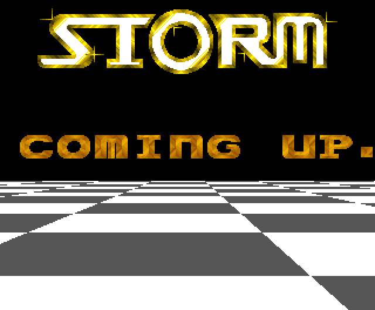
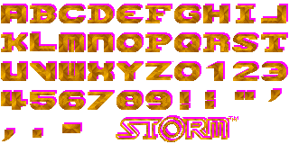

# STORM - "STORM COMING UP"
## An Amiga Intro Disassembly

This is the disassembled and slightly modernized version
of the intro *Storm Coming Up* by the Amiga scene group
[Storm](https://demozoo.org/groups/2754/), released in
November 1989.

The intro does not have credits and only lists some member
names of Storm, but it can be assumed the coding was done
by "[Chris](https://demozoo.org/sceners/54626/)" who is
mentioned as the coder in other Storm productions.

The disassembly was done using ReSource V6.06 on an emulated
Amiga. The graphics were extracted from the executable file
using [Maptapper](https://codetapper.com/amiga/maptapper/)
and [HxD](https://mh-nexus.de/en/hxd/) for Windows. Further
editing and testing was done using
[Visual Studio Code](https://code.visualstudio.com/) with the
[Amiga Assembly](https://github.com/prb28/vscode-amiga-assembly)
extension.

## Inner Workings

I found the intro always fascinating because of its perfect
rotating checkerboard. The effect is done in two ways:
* The vertical coloring is exclusively done with the Copper
  coprocessor. Colors are set at calculated Y-positions and
  switch between white and gray.
* The horizontal coloring is done with lines drawn from top
  to bottom with the Blitter line functions and then filling
  them in with the Blitter, creating wide stripes.

To make calculations and drawing easier, the stripes are drawn
on bitplane 1 and a board mask is drawn on bitplane 2. The
part of the screen not covered by the mask is shown as black
by setting the color registers appropriately.

Both bitplanes are shown here as examples:

Because the Blitter is not almighty fast, the intro uses
triple-buffering (three screen buffers) for the checkerboard
and while one screen is shown, another is being drawn and
while it is filled with the Blitter, the third is being
cleared using the CPU.

## The Code

The disassembly was not done to the last bit and I might have
misunderstood certain functions of the code, so bear with me.
The intro assembles in VS Code and works in the supplied form.

The following changes were done to the code:
* Added the modern
  [startup.i code](https://github.com/MK1Roxxor/MiniStartup)
  by StingRay.
* Removed restoring the system display that is now handled
  by startup.i.
* Removed waiting for the floppy drives to shut down which
  was done by looking at the motor status in undocumented
  system variables which is not compatible to newer OS ROMs.
  See the commented function `WaitDisksOff` in the code.
* Modified the existing SoundTracker music playback routine
  to wait using raster lines instead of a CPU wait that is
  too quick on faster processors.

## Music

The music called "[kawai-k1](https://demozoo.org/music/159270/)"
or "transformer" was created by [Starbuck](https://demozoo.org/sceners/11457/)
in SoundTracker and taken from [another intro](https://demozoo.org/productions/231161/)
by scene group [Spreadpoint](https://demozoo.org/groups/3361/). No
credit was given. (Boo!)

## Graphics

Here's a screenshot of the intro running (click for YouTube
video):

The STORM logo by itself:

And the font graphics used for the scroll text with the drop
shadow colored in:

## References

* [Demozoo](https://demozoo.org/productions/208122/)
* [Pouet](https://www.pouet.net/prod.php?which=14748)
* [Kestra BitWorld](http://janeway.exotica.org.uk/release.php?id=2641)

## Author
MnemoTroN / Spreadpoint, Jan 2024
